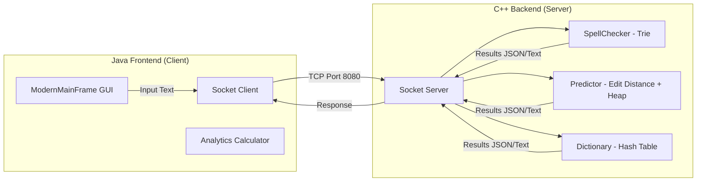

# ⌨️ TypeMaster – Intelligent Text Engine

<p align="center">
  
  
  
  
  
</p>

An **offline intelligent text processing and typing analysis system** combining a high-performance **C++ backend** server with an interactive **Java Swing desktop client** communicating via TCP sockets. 

This project demonstrates practical implementations of core **Data Structures & Algorithms** (Trie, Hash Tables, Heaps) to solve real-world problems (spell checking, autocompletion, analytics) with near-zero latency.


## 🎯 Key Features

* **Real-Time Spell Checking**: Employs a custom **Trie** structure on the backend to validate word spells instantly as you type.
* **Intelligent Word Prediction**: Computes predictions using **Edit Distance (Levenshtein algorithm)** sorted by a **Max-Heap (Priority Queue)** to suggest the closest matches.
* **Instant Dictionary Lookup**: Uses a fast custom **Hash Table** for O(1) word searches and definitions.
* **Typing Performance Analytics**: Measures real-time typing dynamics including **WPM** (Words Per Minute), **CPM** (Characters Per Minute), and **Accuracy Percentage**.
* **Offline Client-Server Model**: Communication is handled entirely locally via **TCP Socket Programming** on port `8080`, separating business logic (C++) from UI presentation (Java).

---

## 🧠 System Architecture



---

## 🛠️ Technology Stack

* **Backend (Logic Server)**: C++ (C++17 standard)
  * Concepts: Socket programming (Winsock / POSIX sockets), Trie Trees, Hash Tables, Priority Queues.
* **Frontend (Desktop GUI)**: Java (JDK 17+)
  * Layout: Java Swing, AWT, Event Dispatch Thread (EDT).
* **Communication Protocol**: TCP/IP Sockets (Raw Strings/JSON streams).

---

## 📂 Project Structure

```text
TypeMaster-Intelligent-Text-Engine/
├── cpp_backend/              # C++ Backend Server
│   ├── include/              # Header declarations (.h)
│   └── src/                  # Implementation files (.cpp)
├── java_frontend/            # Java Swing Client
│   └── src/                  # Swing Frame, Sockets, and Main entrypoint
├── docs/                     # Comprehensive Architecture & Guides
│   ├── 02_Project_Overview.md
│   ├── 03_Installation_and_Running.md
│   ├── 04_User_Guide.md
│   ├── 05_Data_Structures.md
│   ├── 06_System_Architecture.md
│   └── 08_Performance_Analysis.md
├── dictionary.csv            # Static offline word dictionary database (14.8 MB)
└── README.md
```

---

## ⚙️ Setup & Installation

### Prerequisites
Make sure you have both Java JDK and a C++ compiler installed:
```bash
# Verify Java Installation
java -version
javac -version

# Verify C++ Compiler Installation
g++ --version
```

### 1️⃣ Clone the Repository
```bash
git clone https://github.com/Faizan-Niazi/TypeMaster-Intelligent-Text-Engine.git
cd TypeMaster-Intelligent-Text-Engine
```

### 2️⃣ Compile the Backend (C++)
* **Linux / macOS**:
  ```bash
  cd cpp_backend/src
  g++ -std=c++17 *.cpp -o TypeMaster_Backend
  ```
* **Windows (MinGW)**:
  ```bash
  cd cpp_backend/src
  g++ -std=c++17 *.cpp -o TypeMaster_Backend.exe -lws2_32
  ```

### 3️⃣ Compile the Frontend (Java)
```bash
cd ../../java_frontend
javac *.java
```

---

## 🚀 Running the Application

Always boot the **C++ backend server first** so the Java client can establish a socket connection.

### Step 1: Start Backend Server
* **Linux / macOS**:
  ```bash
  cd cpp_backend/src
  ./TypeMaster_Backend
  ```
* **Windows**:
  ```bash
  cd cpp_backend/src
  TypeMaster_Backend.exe
  ```
* *Expected Console Output*:
  ```text
  Dictionary fully loaded
  Server ready. Waiting for Java...
  ```

### Step 2: Start Java Client
In a new terminal window:
```bash
cd java_frontend
java ModernMainFrame
```
Once the GUI frame launches, the backend terminal will log: `Client Connected!` and the typing test canvas will be fully active.

---

## 📄 Documentation & Performance Analysis
For detailed code flow charts, data structure time/space complexity comparisons, and UML diagrams, please navigate to the [docs/](file:///f:/Work/TypeMaster-Intelligent-Text-Engine/docs/) directory.

---

## 📜 License
This project is licensed under the **MIT License**. Feel free to use, modify, and share this codebase for personal, academic, or professional projects.
